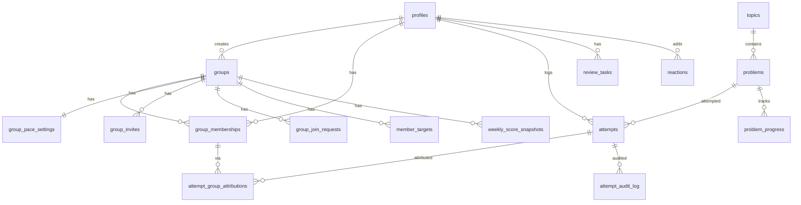

# Grid150 data model

Backend: **Supabase** (Postgres + Auth + RLS + Realtime + Postgres RPCs). No Storage buckets. No Edge Functions for domain logic — scoring, unlock, and attribution live in `SECURITY DEFINER` SQL functions.

Project ref: `gvtprsfkvhdwbfvwynog` (region `us-east-1`). Auth provider: email/password. Browser clients use the **anon** key only.

This project’s schema owns the tables below. The same database may also contain unrelated `public.alba_*` tables from another app; Grid150 migrations and seed never modify them.

## ERD



## Tables

| Table | Purpose | Key columns |
| --- | --- | --- |
| `profiles` | Display name, timezone, focused group | `id` → `auth.users`, `display_name`, `timezone`, `focused_group_id` |
| `topics` | Ordered NeetCode topics | `slug`, `name`, `sort_order` |
| `problems` | Global ordered NeetCode 150 | `topic_id`, `slug`, `title`, `difficulty`, `global_order` (1–150) |
| `groups` | Study groups | `name`, `visibility` (public/private), `join_mode` (open/approval), `created_by` |
| `group_memberships` | Roles + join window | `role` (owner/admin/member), `joined_at`, `left_at` |
| `group_join_requests` | Approval-mode joins | `status` (pending/approved/rejected) |
| `group_invites` | Invite codes | `code` (4–12 chars), `expires_at`, `revoked_at` |
| `group_pace_settings` | Pace markers + defaults | `problems_per_week`, `deadline`, `active_days`, `pace_marker_*`, `default_daily_new_target` |
| `member_targets` | Personal daily new-problem target | `daily_new_target`, `pending_*` (next week) |
| `attempts` | Honor-based log (owner-only SELECT for private fields) | `attempt_type`, `outcome`, `confidence`, `could_explain`, `private_reflection`, `invalidated_at` |
| `attempt_group_attributions` | Which groups an attempt counts for | `attempt_id`, `group_id`, `membership_id` |
| `problem_progress` | Per-user unlock/completion | `status` (locked/available/completed) |
| `review_tasks` | Due reviews | `due_at`, `status` |
| `weekly_score_snapshots` | Server-computed weekly scores | `progress`, `consistency`, `improvement`, `total`, solve counts |
| `reactions` | Preset reactions on activity | `kind`, `target_type`, `target_id` |
| `attempt_audit_log` | Edits / deletes / invalidations | `action`, `reason`, `payload` |

Full DDL: [`supabase/migrations/20260919190000_init_schema.sql`](../supabase/migrations/20260919190000_init_schema.sql). Later migrations add RPCs, RLS policies, invite helpers, analytics RPCs, and realtime publication.

## Public RPCs (authenticated)

| RPC | Role |
| --- | --- |
| `create_group` | Create group + owner membership + invite |
| `delete_group` | Owner soft-clean attributions then delete group |
| `join_group_by_code` | Redeem invite |
| `request_join_group` / `resolve_join_request` | Approval join |
| `create_group_invite` / `revoke_group_invite` | Invite lifecycle |
| `set_focused_group` / `set_daily_target` | Chrome focus + next-week target |
| `log_attempt` / `edit_attempt` / `delete_attempt` | Attempt CRUD (10-minute edit window) |
| `invalidate_attempt` / `attempt_invalidation_meta_for_admin` | Admin correction |
| `next_unlocked_problem` / `current_streak` | Personal progress |
| `add_reaction` | Milestone / activity reactions |
| `group_recent_activity` / `list_public_groups` | Analytics feed + discovery |
| `refresh_weekly_score` | Recompute week snapshot |

## Realtime

Publication includes `weekly_score_snapshots`, `group_join_requests`, and `reactions`. Clients subscribe by focused `group_id` and refetch standings / manage / analytics. `attempts` are **not** published (owner-only SELECT; private reflections must not leak).

**Verify:** open Leaderboard Analytics in two tabs as Alex; add a reaction in one; the other updates without a full page refresh.

## RLS proof (private reflections)

Attempts are owner-only for SELECT. Group members see summaries and admin invalidation metadata, never another user’s `private_reflection` or confidence.

Quick check (SQL editor as service role, or fixture [`supabase/tests/p3_domain.sql`](../supabase/tests/p3_domain.sql)):

1. Log in as `alex@grid150.demo` and note a recent attempt id with a reflection.
2. As `marcus@grid150.demo`, `select private_reflection from attempts where id = …` returns zero rows under RLS.
3. Marcus can still call `attempt_invalidation_meta_for_admin` for FAANG and see outcome/timestamps only.

Domain rules (unlock, overdue review block, no retroactive attribution, invalidate clears progress) are proven in the same fixture file.

## Stand up from zero

```bash
npx supabase link --project-ref gvtprsfkvhdwbfvwynog
npx supabase db push --linked
npx supabase db query --linked -f supabase/seed.sql
```

Syllabus (150 problems / 18 topics) is a permanent migration. Demo users and groups are in `supabase/seed.sql` (idempotent for `*@grid150.demo`).

Env for the web app (`web/.env.local`):

```bash
VITE_SUPABASE_URL=https://gvtprsfkvhdwbfvwynog.supabase.co
VITE_SUPABASE_ANON_KEY=<anon key from dashboard>
```

Never put the service role key in Vite env.
